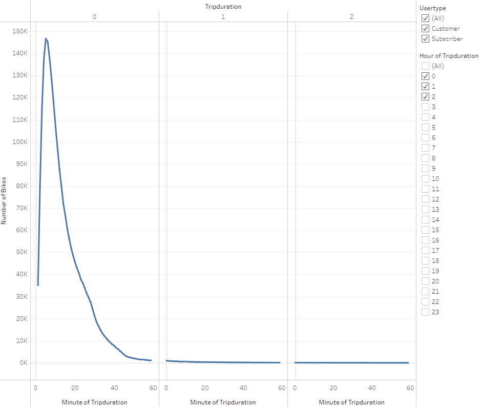

# Bikesharing

Overview of the statistical analysis:

For this proposal I have created a visualization using Tableau using NYC Citibike dataset. During this presentation I will give you an overview of results from the NYC 2019 Citibike to give you a better understanding of the possibilities in Des Moines.

Results:
Please follow along with visualization created with Tableau
[link to dashboard] 
(https://public.tableau.com/app/profile/reynell.paragas/viz/CitiBikeChallenge_16737606650930/NYCStory?publish=yes)

The Citibike sharing program in New York has 2,344,244 users. To give you a visual understanding of the users I broke down the data into two pie charts that explains the customer type and gender breakdown of the customer. First we can see 1,900,359 of the users are subscribed into the citibike program which makes up 81% of the customer type. We also know that 65% of our users are male, 25% are Female and 10% are listed as unknown. Giving us an understanding that our targeted market are male's and an opportunity to increase our users to the female market. 

146,752 of the bikes trip duration average's out to 5 minutes. 

For the number of bikes used during the average trip duration of 5 minutes 108k bikes are used by males customers. 33k bikes are used by female customers and 5.6k are registered as unknown. 

The heat map displays the highest usage within the week with the white-black colors displaying the highest usage time. The highest usage times are 8am-9am and 4pm-7pm Monday through Friday.

This heat map gives us an understanding of the usage times between customers registered as Male, Female, and Uknown. Highest times still align from 8am-9am and 4pm-7pm Monday through Friday.

Using a heat map we can also differantiate our standard customer vs subscribers broken down by gender throughout the week. Subscribers make up majority of our usage and our highest usage throughout the week would be male subscriber.

For the last slide I broke down the top start and end locations with the gold bubbles highlighting best locations to place the Citibike

Summary:

Des Moines can see great success based on the New york Citibike data set. While compiling the data I can safely predit three facts.

    1. We can expect a higher amount of subscribers vs one time use customers. This supports the stability of the business idea.
    2. With strategic placement at work locations, apartments and along the Des Moines river we can expect to be successful. 
    3. Based on the heat map usage times the most common usage would be to get to and from work.

For further analysis it would be ideal to include profit margins with analysis of expected expenses. It would also be helpful to add an additional analysis of the average length a customer would stay subscribed as a citibike sharing program. 